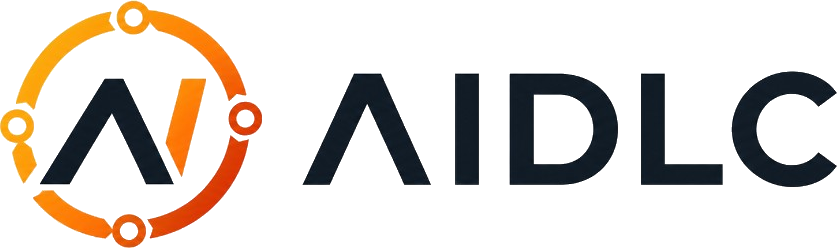

<p align="center">
  
</p>

<h1 align="center">AIDLC</h1>
<p align="center"><strong>AI-Powered SDLC Platform</strong></p>

<p align="center">
  Ship faster with intelligent quality — from requirements to release, in one workspace.
</p>

<p align="center">
  
  
  
  
  
</p>

---

## Overview

**AIDLC** is a full-stack platform that brings AI into every stage of the software delivery lifecycle. It helps teams analyze requirements, generate tests, review code, predict defects, gate releases, and monitor production — with a polished React dashboard and a FastAPI backend powered by Ollama.

Built by [WayamAI](https://github.com/WayamAI).

```
┌─────────────────────────────────────────────────────────────┐
│  Frontend (Vite + React + shadcn/ui)          :8080         │
│  Dashboard · Pipeline · AI Workspace · Code Review          │
└──────────────────────────┬──────────────────────────────────┘
                           │  /api/*
┌──────────────────────────▼──────────────────────────────────┐
│  Backend (FastAPI)                            :8000         │
│  Requirements · Test Gen · GitHub · Jira · CI Intel         │
└──────────────────────────┬──────────────────────────────────┘
                           │
         ┌─────────────────┼─────────────────┐
         ▼                 ▼                 ▼
    MongoDB            Ollama AI         GitHub / Jira
```

---

## Features

### Build & Code
| Module | Description |
|--------|-------------|
| **AI App Builder** | Generate React apps from natural-language prompts |
| **AI Workspace** | Monaco editor with Copilot, Git ops, and impact analysis |
| **Code Reviewer** | AI-powered inline PR review via GitHub integration |
| **Code Impact** | Dependency graph and affected-test mapping |
| **PRD Generator** | Turn ideas into structured product requirements |

### Testing & Quality
| Module | Description |
|--------|-------------|
| **Repo Test Baseline** | Scan repos and generate categorized Playwright tests |
| **Doc-Driven Tests** | Extract test scenarios from documentation |
| **Live Test Runner** | AI-driven browser test execution |
| **Defect Prediction** | File-level risk scoring from commit history |
| **Requirements → Tests** | Analyze requirements and auto-generate test cases |

### Release & Ops
| Module | Description |
|--------|-------------|
| **SDLC Pipeline** | End-to-end delivery workflow across stages |
| **Deployments** | Vercel deployment tracking |
| **Release Gate** | AI-assisted go / no-go release decisions |
| **CI Intelligence** | Workflow health, flaky test detection, failure explanation |
| **Monitoring** | Anomaly detection on time-series metrics |

---

## Quick Start

### Prerequisites

| Tool | Version |
|------|---------|
| Python | 3.12+ |
| Node.js | 18+ |
| MongoDB | 7+ (Docker recommended) |
| Ollama | Local or [Ollama Cloud](https://ollama.com) |

### 1. Clone & configure

```bash
git clone https://github.com/WayamAI/AIDLC.git
cd AIDLC
```

### 2. Start MongoDB

```bash
docker run -d --name aidlc-mongo -p 27017:27017 -v aidlc-mongo-data:/data/db mongo:7
```

### 3. Backend

```bash
cd backend
cp .env.example .env
# Edit .env — set MONGODB_URI, OLLAMA_BASE_URL, OLLAMA_API_KEY, OLLAMA_MODEL

python -m venv .venv
# Windows
.venv\Scripts\activate
# macOS / Linux
source .venv/bin/activate

pip install -r requirements.txt
uvicorn main:app --host 127.0.0.1 --port 8000 --reload
```

API docs: [http://127.0.0.1:8000/docs](http://127.0.0.1:8000/docs)

### 4. Frontend

```bash
cd frontend
cp .env.example .env
npm install
npm run dev
```

Open [http://localhost:8080](http://localhost:8080) — the Vite dev server proxies `/api` to the backend.

---

## Environment Variables

### Backend (`backend/.env`)

| Variable | Required | Description |
|----------|----------|-------------|
| `MONGODB_URI` | Yes | MongoDB connection string |
| `MONGODB_DB` | Yes | Database name (default: `aidlc`) |
| `OLLAMA_BASE_URL` | For AI | `http://localhost:11434` or `https://ollama.com` |
| `OLLAMA_API_KEY` | For AI | API key for Ollama Cloud |
| `OLLAMA_MODEL` | For AI | e.g. `gpt-oss:120b` or `llama3.1` |
| `GITHUB_TOKEN` | Optional | Private repos & higher rate limits |
| `JIRA_DOMAIN` / `JIRA_EMAIL` / `JIRA_TOKEN` | Optional | Jira sprint intelligence |
| `VERCEL_TOKEN` | Optional | Deployment tracking |

See `backend/.env.example` for the full list.

---

## Project Structure

```
AIDLC/
├── backend/                 # FastAPI API server
│   ├── app/
│   │   ├── routes/          # REST endpoints
│   │   ├── services/        # Business logic & integrations
│   │   ├── engines/         # AI test generation pipeline
│   │   └── models/          # Pydantic / DB models
│   └── main.py
├── frontend/                # Vite + React SPA
│   ├── src/
│   │   ├── pages/           # Route-level views
│   │   ├── components/      # UI components (shadcn/ui)
│   │   └── lib/             # API client, design system, brand
│   └── public/
│       └── videos/          # Login hero video assets
├── VERCEL_DEPLOY.md         # Step-by-step Vercel deployment guide
├── vercel.json              # Full-stack Vercel config (frontend + API)
├── api/index.py             # Serverless FastAPI entrypoint
├── requirements.txt         # Python deps for Vercel (slim, no Playwright)
├── SETUP.md                 # Detailed local setup guide
└── DEV_CHECKLIST.md         # Development checklist
```

---

## Tech Stack

**Frontend**
- React 18 · TypeScript · Vite
- Tailwind CSS · shadcn/ui · Framer Motion
- TanStack Query · React Router · Recharts
- Monaco Editor · Sigma.js (dependency graphs)

**Backend**
- FastAPI · Motor (async MongoDB) · Pydantic v2
- Ollama / OpenAI-compatible API for LLM calls
- Playwright · GitPython · httpx

---

## Scripts

```bash
# Frontend
cd frontend && npm run dev      # Dev server (:8080)
cd frontend && npm run build    # Production build
cd frontend && npm test         # Vitest

# Backend
cd backend && uvicorn main:app --reload --port 8000
```

---

## Deployment

### Vercel (recommended)

**One-click full stack** — import the repo on [Vercel](https://vercel.com/new). The root `vercel.json` builds the frontend and runs the FastAPI API at `/api` on the same domain.

```bash
# Or deploy via CLI
npm i -g vercel && vercel login && vercel --prod
```

**Required Vercel env vars:** `MONGODB_URI` (Atlas), `OLLAMA_BASE_URL`, `OLLAMA_API_KEY`, `OLLAMA_MODEL`

Full guide: **[VERCEL_DEPLOY.md](./VERCEL_DEPLOY.md)**

| Deploy mode | Root directory | Config |
|-------------|----------------|--------|
| Full stack (recommended) | `.` | `vercel.json` |
| Frontend only | `frontend` | `frontend/vercel.json` + `VITE_API_URL` |
| Backend only | `backend` | `backend/vercel.json` |

> **Note:** Live Playwright execution and AI IDE WebSockets require a VM — see `frontend/DEPLOY_AZURE_VM.md`.

### Other platforms

Both `frontend/` and `backend/` can also deploy independently. Point `VITE_API_URL` at your API URL for split deployments.

---

## Contributing

1. Fork the repository
2. Create a feature branch (`git checkout -b feature/my-feature`)
3. Commit your changes
4. Open a pull request against `main`

---

## License

Proprietary — © [WayamAI](https://github.com/WayamAI). All rights reserved.

---

<p align="center">
  <sub>Built with care by the WayamAI team</sub>
</p>
# AIDLC_final
